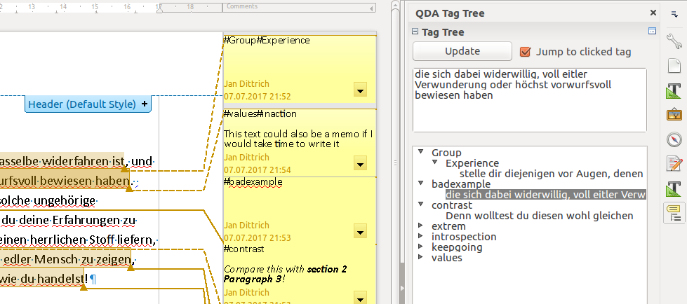

<!--
This file is part of libreoffice-qda-tagtree.
SPDX-FileCopyrightText: 2021-2022 Mirian Margiani
SPDX-FileCopyrightText: 2017 Jan Dittrich
SPDX-License-Identifier: GPL-3.0-or-later
-->

# QDA Tag Tree for LibreOffice

A LibreOffice addon that finds comments that have `#hashtags` in them. It shows
all these comments in a tree control in the sidebar (after the user pressed the
update button).

## How to use

- Open document with the text you want to analyze
- Mark sections and create comments on them (Ctrl+Alt+C)
- Write your codes as hashtags in the comment, e.g. `#fluffy`
    - Nested subcodes can be added as well like `#fluffy#unicorn`, which will generate a subtag *unicorn* below *fluffy*
- Click on **update** in the QDA Tag Tree panel
- Tree will be generated at the lower two thirds of the panel
    - If you click on a section (not a tag), the marked text the hashtagged comment is referring to will be shown in the upper part of the panel.
    - If the option is selected, a click will also scroll the document to that text.
- Right-click on any tag in the tree (or on the "root" node) to export tags and create reports

## State

The extension is in an early stage of development. It works fine but does not
yet support code books and the user interface is still lacking.

## How to build

To build the extension, simply run the `build.sh` script. It basically creates
a `zip` file of the `qda-tagtree` directory and changes the file extension to
`.oxt`.

## License

> QDA Tag Tree, a LibreOffice Extension helping you to analyse transcripts.
>
> Copyright (C) 2017  Jan Dittrich
>               2021-2022  Mirian Margiani
>
> This program is free software: you can redistribute it and/or modify
> it under the terms of the GNU General Public License as published by
> the Free Software Foundation, either version 3 of the License, or
> (at your option) any later version.
>
> This program is distributed in the hope that it will be useful,
> but WITHOUT ANY WARRANTY; without even the implied warranty of
> MERCHANTABILITY or FITNESS FOR A PARTICULAR PURPOSE.  See the
> GNU General Public License for more details.
>
> You should have received a copy of the GNU General Public License
> along with this program.  If not, see <http://www.gnu.org/licenses/>.

Scaffold code was generated using [unodit](https://github.com/kelsa-pi/unodit).
This would not have been possible without it.

This project follows the [REUSE specification](https://api.reuse.software/info/github.com/ichthyosaurus/libreoffice-qda-tagtree).
